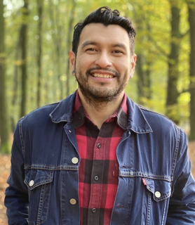
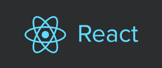
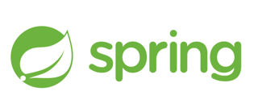
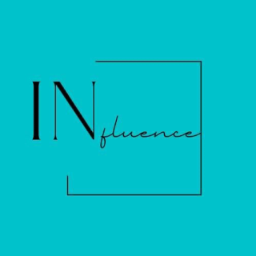
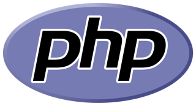

# guilhermodaguiar.github.io

## My GitHub pages 

> Hi there.. thanks for reading my README.md
> This page contains the markup language Markdown 
> I want to edit the whole page in Markdown..Wish me Luck!!
> This page is intended to post my journey and profile my github page
> I am the start of my Journey as a Junior Full Stack Developer and I have learnt a lot already.
> Most of all I have more to learn and am excited about that. 

## About me

- First of all a Father, Husband and a creative soul that enjoys Music and Art. I was born in Apoera. A small native town in Suriname 🇸🇷. I moved to Aruba 🇦🇼 at  age of 4 and at 22 I moved to the Netherlands 🇳🇱 where I started my life with my family. I live in Utrecht, which is the fourth biggest city :city_sunset: in the Netherlands after Amsterdam, Rotterdam and Den Haag (The Hague). I like the city life, especialy through all seasons especially autumn :fallen_leaf: , which is beautiful when the leaves start falling. But somethimes it is good to get out of the city to enjoy a hike and get to my zen moment.
- :coffee: My Love for Coffee has been at a high. I am a sucker for a good cappuccino in a small coffee tent. If You are ever in Utrecht check out [Koffie en Ik](https://koffieenik.nl)
- :curry: I enjoy taking my time to cook although recently i have not been much in the kitchen.
- :chart_with_upwards_trend: Investing time in stocks. Learning about companies and enjoying the learning pattern.
- :computer: A junior developer learning the ins and outs about developing. I wil be investing more time in updating my GitHub profile for future projects. For now I am working on building my own webshop from scratch. 
- :deciduous_tree: In 2020 I have choosen to start an own company [LoahyTree](https://www.instagram.com/loahytree/) which sells creative and sustainable child items. The word Loahy in my native language (which i don't speak) means heart and determination. A Tree can be seen as a child. It begins as a seed, as a baby. With good nurture it will grow in a great plant/tree/person. Tree also can be seen as sustainability. 

## NOVI HOGESCHOOL

|                                                      |                                  |                                             |
|------------------------------------------------------|----------------------------------|---------------------------------------------|
|  |  |  |

In order to get a certificate for ***Junior Fullstack Developer*** from [NOVI hogeschool](https://www.novi.nl) in Utrecht, Netherlands, I need to create my own application. I choose to create a webshop named Loahy.nl , beacause in the future I want to get this webshop up and running for LoahyTree. Here are the languages, libraries, frameworks, GUI's that I am using:

  ### Frontend
  
  - HTML/CSS
  - Javascript
  - React.js

  ### Backend
  
  - Java
  - Springboot
  - Maven
  - PostgreSQL

## Influence Aruba

|                                                            |                                  |                                             |
|------------------------------------------------------------|----------------------------------|---------------------------------------------|
|  |  |  |

> New work in progress. 
> :microphone: Excited to add that I will be building a website for **Influence**. 
> A company located in Aruba 🇦🇼 that is dedicated in the Entertainment Industry.
  

## Learnings

> I am also learning with courses at [CodeCademy](https://www.codecademy.com/profiles/GuilyDaguiar). In my profile you can see what courses I am doing and my latest certificates.

|                                                      |                                  |                                                 |
|------------------------------------------------------|----------------------------------|-------------------------------------------------|
| ![Codecademy!(images/codecademy_logo_Klein.png)] |  |  |

- PHP

I am learning PHP to see why it is used for. I now understand the power of PHP. In CMS it is used often. The synthax is quicker to learn beacause of my JS and Java experience. Up to now I have not implemented the synthax in a big project and when I do that, I will create a repository. Also I am thinking about implementing PHP for developing webapllication.

- MongoDB

i am learning MongoDB also to have another way of implementing Databases. I intend to understand and to use both SQL and NoSQL, so when i gain more experience i can have the option to choose depending on the use case and the type of project.

