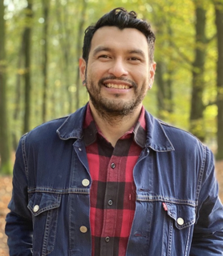
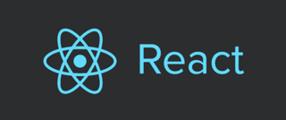

# Guilhermo d'Aguiar 👋

### Medior Backend Java Engineer | React Frontend Skills | DevOps Enthusiast

I am a **Medior Backend Java Engineer** with a strong foundation in building scalable systems. While my core expertise lies in Java and backend architecture, I also bring **Frontend React skills** to the table to build end-to-end applications.

Lately, I've been expanding my horizons into the **DevOps** world, focusing on CI/CD, automation, and infrastructure.

---

## 🛠 Tech Stack

| Backend | Frontend | Database | DevOps |
| :--- | :--- | :--- | :--- |
|  **Java / Spring Boot** |  **React** |  **MongoDB** | 🚀 **Docker, CI/CD, Cloud** |

*(Note: Moving on from PHP to focus on modern Java and JS ecosystems!)*

---

## 🎨 Current Projects

### 👨‍👦 Felipe d'Aguiar Artist Page
I am currently building a dedicated website for my son, **Felipe d'Aguiar**. It's designed to be a creative space to showcase his art.

---

## 📬 Connect with me

- [GitHub](https://github.com/guilhermodaguiar)
- [LinkedIn](https://www.linkedin.com/in/guilhermo-d-aguiar-57922718/)
- [Email](mailto:guilhermo.d.aguiar@gmail.com)

---

> "Evolving from Junior to Medior, one commit at a time."